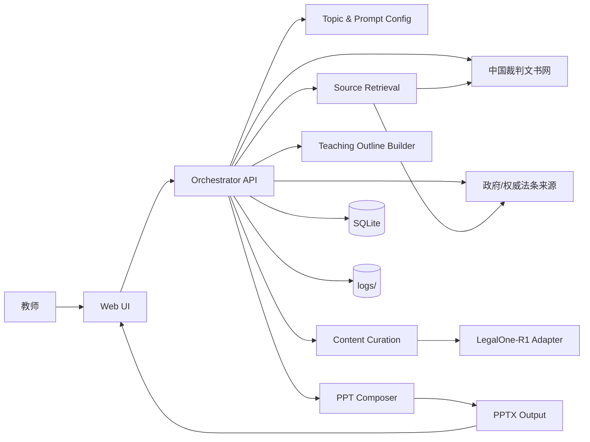

# System Overview

本项目采用本地网页应用架构（单机运行），目标是把“知识点输入 -> 案例检索 -> 内容归纳 -> PPT 生成”做成可重复执行的流水线。

整体由三层组成：
1. `Web UI`：输入知识点、难度分档、导语参数，预览并微调生成结果。
2. `Orchestrator API`：负责编排任务、调用检索与总结模块、控制生成流程与状态。
3. `Generation Engine`：执行来源检索、内容抽取、要点归纳、课件组装和导出。

外部依赖：
- 中国裁判文书网（主来源）
- 政府网站与权威法条解释站点（补充来源）
- LegalOne-R1（总结和教学表达增强）

本地持久化：
- `SQLite`：任务、参数、来源索引、生成记录
- `outputs/`：中间产物与最终 PPT
- `logs/`：检索与生成证据日志

# Architecture Diagram



# Module Boundaries

## 1. Topic Configuration Module

- 责任：管理知识点、课程类型（民法/刑法）、难度分档与用户参数覆盖
- 输入：教师表单输入
- 输出：标准化的 `LessonTopic` 配置对象
- 边界：不处理检索和生成，仅负责参数合法性与默认值计算

## 2. Source Retrieval Module

- 责任：按来源优先级检索案例与法条解释信息
- 输入：`LessonTopic` + 检索策略
- 输出：`SourceItem[]`
- 边界：只抓取和标准化元数据，不做教学总结
- 合规执行：默认优先官方检索/API/可下载路径；仅在条款允许且无替代路径时启用浏览器自动化（Playwright）

## 3. Content Curation Module

- 责任：抽取案例事实、争议焦点、裁判要旨并做结构化归纳
- 输入：`SourceItem[]`
- 输出：`CaseMaterial[]` + `LawReference[]`
- 边界：只做内容清洗和结构化，不决定课件叙事顺序

## 4. Teaching Outline Module

- 责任：将知识点、案例和法条组织为课堂讲授逻辑
- 输入：`LessonTopic` + `CaseMaterial[]` + `LawReference[]`
- 输出：`SummaryBlock[]`（章节结构、每页目标、课堂互动点）
- 边界：不生成最终 PPT 文件

## 5. PPT Composition Module

- 责任：把结构化教学内容写入 PPT 模板并导出 `.pptx`
- 输入：`SummaryBlock[]` + 模板参数
- 输出：`PPTDeck` + 文件路径
- 边界：不回写检索逻辑，仅处理版式和导出

## 6. Citation & Quality Gate Module

- 责任：在导出前执行来源完整性与引用校验
- 输入：待导出的 `PPTDeck` 和来源清单
- 输出：校验结果（通过/失败）+ 问题列表
- 边界：只做校验，不直接改写内容

# Repository Structure

```text
PROJECT_ROOT/
├─ README.md
├─ .gitignore
├─ .env.example
├─ frontend/
│  ├─ src/
│  │  ├─ pages/
│  │  ├─ components/
│  │  ├─ features/topic-config/
│  │  ├─ features/preview-editor/
│  │  └─ services/api-client/
│  └─ tests/
├─ backend/
│  ├─ app/
│  │  ├─ api/
│  │  ├─ modules/topic_config/
│  │  ├─ modules/source_retrieval/
│  │  ├─ modules/content_curation/
│  │  ├─ modules/teaching_outline/
│  │  ├─ modules/ppt_composition/
│  │  ├─ modules/quality_gate/
│  │  ├─ integrations/legalone_r1/
│  │  └─ infrastructure/
│  └─ tests/
├─ docs/
│  ├─ requirements.md
│  ├─ architecture.md
│  ├─ plans/
│  └─ complete/
├─ outputs/
└─ logs/
```

# Key Decisions

| Decision | Choice | Rationale | Risk | Mitigation |
|---|---|---|---|---|
| 应用形态 | 本地网页应用 | 符合当前个人使用，后续可平滑扩展到多人部署 | 本地环境差异导致启动问题 | Phase 3 首任务加入环境初始化与健康检查 |
| 架构风格 | 前后端分层 + 流水线模块化 | 便于把检索、总结、生成解耦，后续替换模块成本低 | 初期模块数量较多 | 先落最小闭环，非核心能力延后 |
| 数据存储 | SQLite + 本地文件 | 单机 MVP 成本最低，便于追溯生成记录 | 并发与规模受限 | 后续产品化可迁移到服务端数据库 |
| 模型接入 | LegalOne-R1 通过适配器封装 | 避免业务层直接耦合模型接口 | 模型接口变化造成中断 | 统一 `integrations/legalone_r1` 出口 |
| 外部站点访问 | 合规优先的分级采集策略 | 降低违规采集与封禁风险 | 采集覆盖率下降 | 采用“官方路径优先 + Playwright 条件启用” |
| 课件生成 | 程序化 PPT 生成（模板驱动） | 可控、可复现、便于批量迭代 | 模板质量影响观感 | Phase 3 增加模板回归测试与人工评审 |
| 引用治理 | 导出前强制 Citation Gate | 保证可追溯和权威来源优先 | 规则过严导致生成失败率升高 | 允许回退到“告警 + 人工确认”模式 |

# Architecture Selection by Project Characteristics

## Frontend (Chosen)

- 架构：`React + Vite + TypeScript`，采用 `pages/components/features/services` 分层。
- 适配原因：
  - 页面需要持续扩展为“参数配置 + 预览编辑 + 质量告警”多模块交互。
  - TypeScript 可提前约束教学数据模型（`LessonTopic`、`SummaryBlock`）字段一致性。
  - Vite 启动快，适合本地高频迭代。

## Backend (Chosen)

- 架构：Node.js 分层模块化骨架，采用 `api/modules/integrations/infrastructure` 分层。
- 适配原因：
  - 项目是“检索 -> 归纳 -> 生成 -> 校验”的流水线，模块边界清晰，便于按任务逐步实现。
  - 集成点多（来源站点、LegalOne-R1、存储、日志），需要显式的适配层隔离外部依赖。
  - 本地单机 MVP 阶段优先保证可运行与可追溯，后续可平滑迁移到更重的服务框架。

# External Dependency Compliance Policy

## A. 中国裁判文书网（wenshu.court.gov.cn）

- 当前策略：不做批量自动化抓取，不使用 Playwright 绕过访问验证。
- 理由：站点 `robots.txt` 为 `User-agent: * / Disallow: /`，且存在 WAF 验证页。
- 可行路径：人工检索导入、官方公开下载路径、或经授权的数据获取方式。

## B. 政府网站（gov.cn 及同类官方站点）

- 当前策略：逐站白名单评估后再接入，不做“默认可抓取”假设。
- 必查项：网站声明、用户协议、版权/转载条款、robots 规则（若提供）。
- 执行约束：低频访问、限流重试、不得绕过验证码/鉴权、保留访问日志与来源证据。

## C. LegalOne-R1（开源模型）数据使用边界

- 结论：模型开源不等于可自由抓取第三方网站数据。
- 原则：模型许可仅约束“模型及其权重/代码使用”，数据抓取合法性由目标网站条款与适用法律决定。
- 本项目要求：LegalOne-R1 仅处理“已合法取得”的文本；禁止把未授权抓取内容作为默认数据来源。
- 工程措施：在 `integrations/legalone_r1` 增加输入来源标签校验（authorized/manual/imported），未标注来源的数据不进入模型流程。

# Post-Approval TODOs

- 在 Phase 3 实施前固定 LegalOne-R1 的具体版本（仓库提交哈希/发布版本号）并完成一次 LICENSE 合规复核，结果记录到 `docs/complete/` 对应执行记录。

# Stack Skills Baseline

本阶段完成 baseline stack-skill discovery，并将结果同步到 `app-development-workflow/references/stack/STACK-SKILL-MAP.md`。

| Stack Skill | Purpose | Baseline Decision |
|---|---|---|
| `local-web-app` | 本地网页应用运行与开发基础 | 必需 |
| `legal-source-search` | 法律来源检索策略与抓取规范 | 必需 |
| `content-extraction-and-summarization` | 案例/法条结构化抽取与总结 | 必需 |
| `citation-traceability` | 引用可追溯与来源标注 | 必需 |
| `ppt-generation` | 程序化课件生成 | 必需 |
| `llm-integration-legalone-r1` | 法律模型接入与调用封装 | 必需 |
| `prompt-parameterization` | 导语提示与用户参数化控制 | 必需 |

# approval_record

- phase: 2-step-1
- status: PASS(manual)
- approved_by: Greg Huang
- approved_at: 2026-03-13T16:39:29+08:00
- comment: 用户回复“通过”，阶段 2 步骤 1 签核完成

# rejection_record

- phase: 2-step-1
- issue_type: documentation / process
- requested_change: 增加外部依赖条款合规策略，并明确 Playwright 是否可用于检索
- action_taken: 已新增 `External Dependency Compliance Policy`，明确裁判文书网禁批量自动化抓取、政府站点逐站白名单评估、LegalOne-R1 仅处理合法来源数据
- retest_or_recheck: architecture.md 已更新，待用户重新签核

- phase: 2-step-2
- issue_type: documentation / process
- requested_change: 人工签批用户名改为 Greg Huang，并补齐网页端开发 skills
- action_taken: 已将审批记录用户名更新为 Greg Huang；已执行 find-skills 并安装 `web-dev` 与 `playwright`，同步更新计划与 STACK-SKILL-MAP
- retest_or_recheck: phase-2 文档已更新，待用户重新签核
